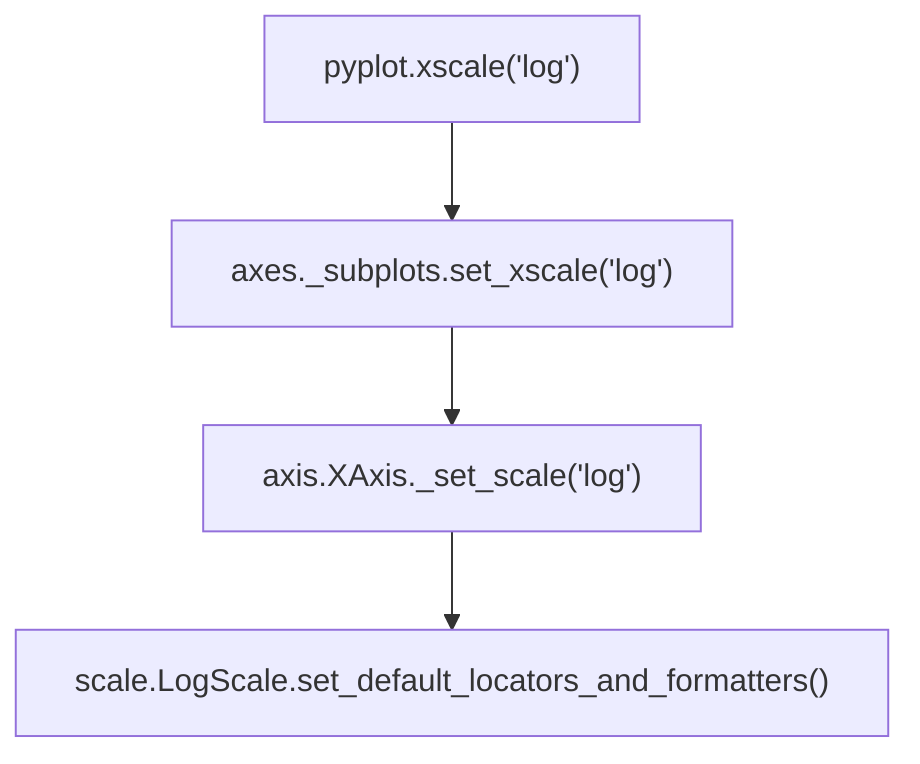

## 发现问题

众所周知，设置 matplotlib 输出中文需要：

plt.rcParams['font.sans-serif']=['SimHei']  # 用来正常显示中文标签
plt.rcParams['axes.unicode_minus']=False  # 用来正常显示负号

<!--more-->

第一行是设置字体（推荐使用 `.insert(0, fontname)` 而非直接赋值）

第二行则是设置减号（`-` ）采用 ASCII 码查找字体，而非 unicode 编码。

但是，在使用过程中发生了错误。

复现错误：

```python
# -*- coding: UTF-8 -*-
%matplotlib inline

import matplotlib.pyplot as plt

plt.rcParams['font.sans-serif']=['SimHei']
plt.rcParams['axes.unicode_minus']=False


plt.figure(figsize=(18,9))

data = [0.001*(10**i) for i in range(4)]
bins = 10**(np.linspace(-3, 2))
plt.hist(data, bins = bins, label = 'test')

plt.xscale('log')
plt.ylabel('English test')
plt.title('汉字测试')

plt.show()
```

会发生这样的错误：

> ```
> %pythonlib%\matplotlib\mathtext.py:849: MathTextWarning: Font 'default' does not have a glyph for '-' [U+2212]
>   MathTextWarning)
> %pythonlib%\matplotlib\mathtext.py:850: MathTextWarning: Substituting with a dummy symbol.
>   warn("Substituting with a dummy symbol.", MathTextWarning)
> ```

我们可以认为是 '-' 导致的出错。

通过在 github 上的 [matplotlib 项目](https://github.com/matplotlib/matplotlib) 查找，可以找到这个文件 [matplotlib/examples/text_labels_and_annotations/unicode_minus.py](https://github.com/matplotlib/matplotlib/blob/master/examples/text_labels_and_annotations/unicode_minus.py) ，通过看文件名，大致可知其为 `unicode_minus` 的示例文件。

内容如下：

```python
"""
=============
Unicode minus
=============
By default, tick labels at negative values are rendered using a `Unicode
minus`__ (U+2212) rather than an ASCII hyphen (U+002D).  This can be controlled
by setting :rc:`axes.unicode_minus`.
__ https://en.wikipedia.org/wiki/Plus_and_minus_signs#Character_codes
The replacement is performed at draw time of the tick labels (usually during a
`.pyplot.show()` or `.pyplot.savefig()` call). Therefore, all tick labels of
the figure follow the same setting and we cannot demonstrate both glyphs on
real tick labels of the same figure simultaneously.
Instead, this example simply showcases the difference between the two glyphs
in a magnified font.
"""

import matplotlib.pyplot as plt

fig = plt.figure(figsize=(4, 2))
fig.text(.15, .6, "Unicode minus:", fontsize=20)
fig.text(.85, .6, "\N{MINUS SIGN}1", ha='right', fontsize=20)
fig.text(.15, .3, "ASCII hyphen:", fontsize=20)
fig.text(.85, .3, "-1", ha='right', fontsize=20)
plt.show()
```

可知，`unicode_minus` 设置为 `False` 时，理应不使用 U+2212 输出，而是使用 U+002D，然而上面的错误信息却试图输出 U+2212，我们可以认为是这个选项没有起到作用。

## 定位问题

通过注释，我们可以发现出现警告的原因是`plt.xscale('log')` 一行。

不妨在库源码中追溯来源。

```python
import matplotlib.pyplot as plt
```

由此可知，错误是在 `matplotlib.pyplot.xscale` 调用时出现的。

追溯`matplotlib.pyplot.xscale` 可得：

```python
def xscale(*args, **kwargs):
    gca().set_xscale(*args, **kwargs)
```

首先判断 `gca()` 类型，由 `print(gca().__module__)` 输出 `matplotlib.axes._subplots` 。

打开对应模块，会发现找不到 `gca()` 的定义。

改为 `print(type(gca()))` ，输出`<class 'matplotlib.axes._subplots.AxesSubplot'>` 。

虽然未能找到 `AxesSubplot` ，但是观察可得，`AxesSubplot` 应该是 `matplotlib.axes._subplots.SubplotBase`  的一个子类/别名。

然而，在该基类中未能找到对应的函数。

由于 python 具有反射机制，我们想当然地去`matplotlib\axes\_base.py` 中，在`matplotlib.axes._base._AxesBase` 内，可以找到

```python
    def set_xscale(self, value, **kwargs):
        g = self.get_shared_x_axes()
        for ax in g.get_siblings(self):
            ax.xaxis._set_scale(value, **kwargs)
            ax._update_transScale()
            ax.stale = True

        self.autoscale_view(scaley=False)
```

简单分析可知，我们出错的情况下， `set_xscale` 传入参数为 `set_xscale(this, 'log')` 。

也即通过该函数呈递给  `ax.xaxis._set_scale(value, **kwargs)` ，此时`value = 'log', kwargs={}` 。

在呈递前插入

```python
            print(type(ax.xaxis))
```

得到输出`<class 'matplotlib.axis.XAxis'>` 。

由于`XAxis` 继承于`Axis` ，搜索`_set_scale` 可发现其定义于后者，即基类中。

```python
    def _set_scale(self, value, **kwargs):
        self._scale = mscale.scale_factory(value, self, **kwargs)
        self._scale.set_default_locators_and_formatters(self)

        self.isDefault_majloc = True
        self.isDefault_minloc = True
        self.isDefault_majfmt = True
        self.isDefault_minfmt = True
```

通过尝试输出`self._scale` ，可以得到缩放类型为`"log"` 时，该变量类型为`matplotlib.scale.LogScale` 。

目前，我们可以得到这样的呈递关系图：



根据

```python
class LogitScale(ScaleBase):
    ...
```

```python
_scale_mapping = {
    'linear': LinearScale,
    'log':    LogScale,
    'symlog': SymmetricalLogScale,
    'logit':  LogitScale,
    }
```

```python
def scale_factory(scale, axis, **kwargs):
    """
    Return a scale class by name.

    ACCEPTS: [ %(names)s ]
    """
    scale = scale.lower()
    if scale is None:
        scale = 'linear'

    if scale not in _scale_mapping:
        raise ValueError("Unknown scale type '%s'" % scale)

    return _scale_mapping[scale](axis, **kwargs)
scale_factory.__doc__ = cbook.dedent(scale_factory.__doc__) % \
    {'names': " | ".join(get_scale_names())}
```

可得`self._scale = mscale.scale_factory('log')` 等价于`self._scale = mscale.LogScale(self)` 。

到 `class 'matplotlib.scale.LogScale'` 中可以看到方法

```python
    def set_default_locators_and_formatters(self, axis):
        """
        Set the locators and formatters to specialized versions for
        log scaling.
        """
        axis.set_major_locator(LogLocator(self.base))
        axis.set_major_formatter(LogFormatterSciNotation(self.base))
        axis.set_minor_locator(LogLocator(self.base, self.subs))
        axis.set_minor_formatter(
            LogFormatterSciNotation(self.base,
                                    labelOnlyBase=(self.subs is not None)))
```

观察易知，其分别设置刻度的标值和格式。

将设置四行改为

```python
        axis.set_major_locator(NullLocator())
        axis.set_major_formatter(NullFormatter())
        axis.set_minor_locator(NullLocator())
        axis.set_minor_formatter(NullFormatter())
```

可以发现，`plt.show()` 没有了水平刻度值，也没有警告信息。

通过观察可知，`set_major_XXX` 控制刻度值，而`set_minor_XXX` 控制刻度格。

并且错误原因在于`axis.set_major_formatter(LogFormatterSciNotation(self.base))` 。

因为 `LogScale` 默认以 10 为底（`self.base` ），因此可知该句等价于

`Axis.set_major_formatter(LogFormatterSciNotation(10))`

其中，`LogFormatterSciNotation` 类型为 `matplotlib.ticker.LogFormatterSciNotation` 。

---

根据输出的警告信息，我们在对应位置前生成一个异常，可以得到

```python
matplotlib\mathtext.py in __init__(self, c, state, math)
   1454         # The real width, height and depth will be set during the
   1455         # pack phase, after we know the real fontsize
-> 1456         self._update_metrics()
   1457 
   1458     def __internal_repr__(self):

matplotlib\mathtext.py in _update_metrics(self)
   1461     def _update_metrics(self):
   1462         metrics = self._metrics = self.font_output.get_metrics(
-> 1463             self.font, self.font_class, self.c, self.fontsize, self.dpi, self.math)
   1464         if self.c == ' ':
   1465             self.width = metrics.advance

matplotlib\mathtext.py in get_metrics(self, font, font_class, sym, fontsize, dpi, math)
    456             "height".
    457         """"""" # 为了不影响代码高亮，补全引号
--> 458         info = self._get_info(font, font_class, sym, fontsize, dpi, math)
    459         return info.metrics
    460 

matplotlib\mathtext.py in _get_info(self, fontname, font_class, sym, fontsize, dpi, math)
    579 
    580         font, num, symbol_name, fontsize, slanted = \
--> 581             self._get_glyph(fontname, font_class, sym, fontsize, math)
    582 
    583         font.set_size(fontsize, dpi)

matplotlib\mathtext.py in _get_glyph(self, fontname, font_class, sym, fontsize, math)
    907             # otherwise return regular glyph
    908             return super(DejaVuFonts, self).\_get_glyph(fontname,
--> 909                     font_class, sym, fontsize, math)
    910 
    911 

matplotlib\mathtext.py in _get_glyph(self, fontname, font_class, sym, fontsize, math)
    787 
    788     def _get_glyph(self, fontname, font_class, sym, fontsize, math=True):
--> 789         raise "test"
    790         found_symbol = False
    791 
```


此时的 fontname 为 'default'，应当改为其他内容（以满足条件 `fontname in ('it', 'regular')` ）

---

经测试，改 UnicodeFonts 类中 \_get_glyph 内 fontname 为 'it' 可解决问题。

经测试，改 TruetypeFonts 类中 \_get_info 方法的 fontname 为 'it' 也可解决问题。

经测试，改 Fonts 基类中的 get_metrics 方法的 font 为 'it' 无效。

在 \_get_info 添加输出，可以发现其被多处调用。

重新获取另一调用链，可得

```python
matplotlib\mathtext.py in group(self, s, loc, toks)
   2814 
   2815     def group(self, s, loc, toks):
-> 2816         grp = Hlist(toks[0])
   2817         return [grp]
   2818     required_group = simple_group = group

matplotlib\mathtext.py in __init__(self, elements, w, m, do_kern)
   1609         List.__init__(self, elements)
   1610         if do_kern:
-> 1611             self.kern()
   1612         self.hpack()
   1613 

matplotlib\mathtext.py in kern(self)
   1631 
   1632                 new_children.append(elem)
-> 1633                 kerning_distance = elem.get_kerning(next)
   1634                 if kerning_distance != 0.:
   1635                     kern = Kern(kerning_distance)

matplotlib\mathtext.py in get_kerning(self, next)
   1486                 self.font, self.font_class, self.c, self.fontsize,
   1487                 next.font, next.font_class, next.c, next.fontsize,
-> 1488                 self.dpi)
   1489         return advance + kern
   1490 

matplotlib\mathtext.py in get_kern(self, font1, fontclass1, sym1, fontsize1, font2, fontclass2, sym2, fontsize2, dpi)
    634                  font2, fontclass2, sym2, fontsize2, dpi):
    635         if font1 == font2 and fontsize1 == fontsize2:
--> 636             info1 = self._get_info(font1, fontclass1, sym1, fontsize1, dpi)
    637             info2 = self._get_info(font2, fontclass2, sym2, fontsize2, dpi)
    638             font = info1.font

matplotlib\mathtext.py in _get_info(self, fontname, font_class, sym, fontsize, dpi, math)
    580 
    581         font, num, symbol_name, fontsize, slanted = \
--> 582             self._get_glyph(fontname, font_class, sym, fontsize, math)
    583 
    584         font.set_size(fontsize, dpi)

matplotlib\mathtext.py in _get_glyph(self, fontname, font_class, sym, fontsize, math)
    909             # otherwise return regular glyph
    910             return super(DejaVuFonts, self)._get_glyph(fontname,
--> 911                     font_class, sym, fontsize, math)
    912 
    913 

matplotlib\mathtext.py in _get_glyph(self, fontname, font_class, sym, fontsize, math)
    840                 else:
    841                     return self.cm_fallback._get_glyph(
--> 842                         fontname, font_class, sym, fontsize)
    843             else:
    844                 if fontname in ('it', 'regular') and isinstance(self, StixFonts):

matplotlib\mathtext.py in _get_glyph(self, fontname, font_class, sym, fontsize, math)
    845                     return self._get_glyph('rm', font_class, sym, fontsize)
    846                 print(fontname)
--> 847                 raise 'error'
    848                 warn("Font '%s' does not have a glyph for '%s' [U+%x]" %
    849                      (new_fontname,
```

为了方便此后调试，在改动部分加上 `# RecoDebugging` 。

该次 Bug 出错在于 `mathtext.Char.font = 'default'` ，经过捕捉可发现其被 `state.font` 赋值，即 `matplotlib.mathtext.Parser.State.font` 。

追踪这个构造函数调用，可得

```python
matplotlib\mathtext.py in symbol(self, s, loc, toks)
   2638         c = toks[0]
   2639         try:
-> 2640             char = Char(c, self.get_state())
   2641         except ValueError:
   2642             raise ParseFatalException(s, loc, "Unknown symbol: %s" % c)

matplotlib\mathtext.py in __init__(self, c, state, math)
   1449         self.c = c
   1450         self.font_output = state.font_output
-> 1451         raise 'test'
   1452         self.font = state.font
   1453         self.font_class = state.font_class
```

观察 `matplotlib.mathtext.Parser.symbol` 可得，`Parser.State` 构造函数被调用于 

```python
matplotlib\mathtext.py in parse(self, s, fonts_object, fontsize, dpi)
   2513         Returns the parse tree of :class:`Node` instances.
   2514         """""" # end the comment
-> 2515         self._state_stack = [self.State(fonts_object, 'default', 'rm', fontsize, dpi)]
   2516         self._em_width_cache = {}
   2517         try:

C:\ProgramData\Anaconda3\lib\site-packages\matplotlib\mathtext.py in __init__(self, font_output, font, font_class, fontsize, dpi)
   2540         """"""  # end the comment
   2541         def __init__(self, font_output, font, font_class, fontsize, dpi):
-> 2542             raise 'generate state'
   2543             self.font_output = font_output
   2544             self._font = font
```

最终可以发现，`state` 被赋值于此处，只需要修改 `matplotlib.mathtext.Parser.parse` 即可结束此支错误。

---

暂改为 'it'，运行仍然出错，主动抛出异常，捕获链如下：

```python
matplotlib\mathtext.py in group(self, s, loc, toks)
   2815 
   2816     def group(self, s, loc, toks):
-> 2817         grp = Hlist(toks[0])
   2818         return [grp]
   2819     required_group = simple_group = group

matplotlib\mathtext.py in __init__(self, elements, w, m, do_kern)
   1609         List.__init__(self, elements)
   1610         if do_kern:
-> 1611             self.kern()
   1612         self.hpack()
   1613 

matplotlib\mathtext.py in kern(self)
   1631 
   1632                 new_children.append(elem)
-> 1633                 kerning_distance = elem.get_kerning(next)
   1634                 if kerning_distance != 0.:
   1635                     kern = Kern(kerning_distance)

matplotlib\mathtext.py in get_kerning(self, next)
   1486                 self.font, self.font_class, self.c, self.fontsize,
   1487                 next.font, next.font_class, next.c, next.fontsize,
-> 1488                 self.dpi)
   1489         return advance + kern
   1490 

matplotlib\mathtext.py in get_kern(self, font1, fontclass1, sym1, fontsize1, font2, fontclass2, sym2, fontsize2, dpi)
    634                  font2, fontclass2, sym2, fontsize2, dpi):
    635         if font1 == font2 and fontsize1 == fontsize2:
--> 636             info1 = self._get_info(font1, fontclass1, sym1, fontsize1, dpi)
    637             info2 = self._get_info(font2, fontclass2, sym2, fontsize2, dpi)
    638             font = info1.font

matplotlib\mathtext.py in _get_info(self, fontname, font_class, sym, fontsize, dpi, math)
    580 
    581         font, num, symbol_name, fontsize, slanted = \
--> 582             self._get_glyph(fontname, font_class, sym, fontsize, math)
    583 
    584         font.set_size(fontsize, dpi)

matplotlib\mathtext.py in _get_glyph(self, fontname, font_class, sym, fontsize, math)
    909             # otherwise return regular glyph
    910             return super(DejaVuFonts, self)._get_glyph(fontname,
--> 911                     font_class, sym, fontsize, math)
    912 
    913 

matplotlib\mathtext.py in _get_glyph(self, fontname, font_class, sym, fontsize, math)
    840                 else:
    841                     return self.cm_fallback._get_glyph(
--> 842                         fontname, font_class, sym, fontsize)
    843             else:
    844                 if fontname in ('it', 'regular') and isinstance(self, StixFonts):

matplotlib\mathtext.py in _get_glyph(self, fontname, font_class, sym, fontsize, math)
    845                     return self._get_glyph('rm', font_class, sym, fontsize)
    846                 #print(fontname)
--> 847                 raise 'error' # RecoDebugging
    848                 warn("Font '%s' does not have a glyph for '%s' [U+%x]" %
    849                      (new_fontname,
```

