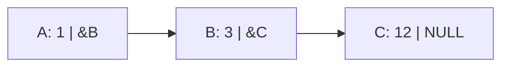
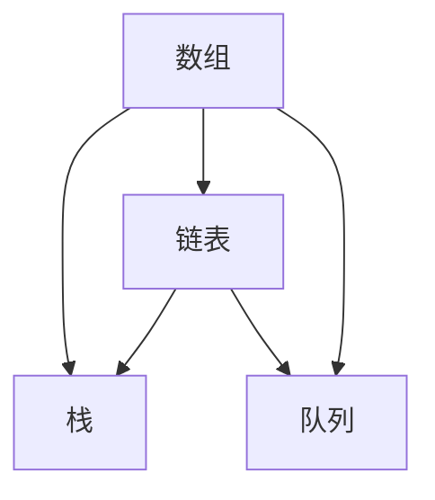
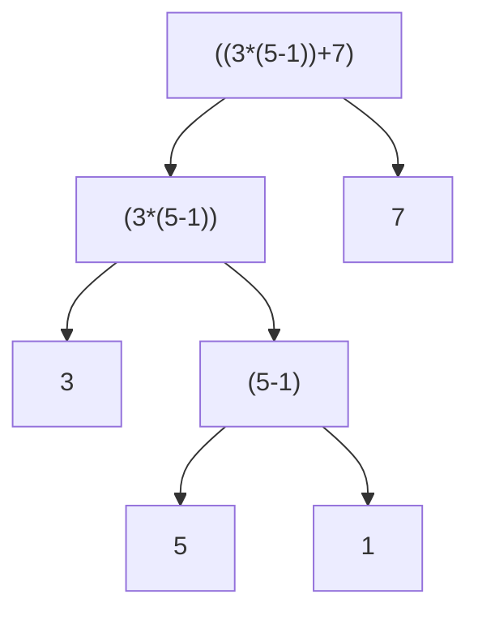
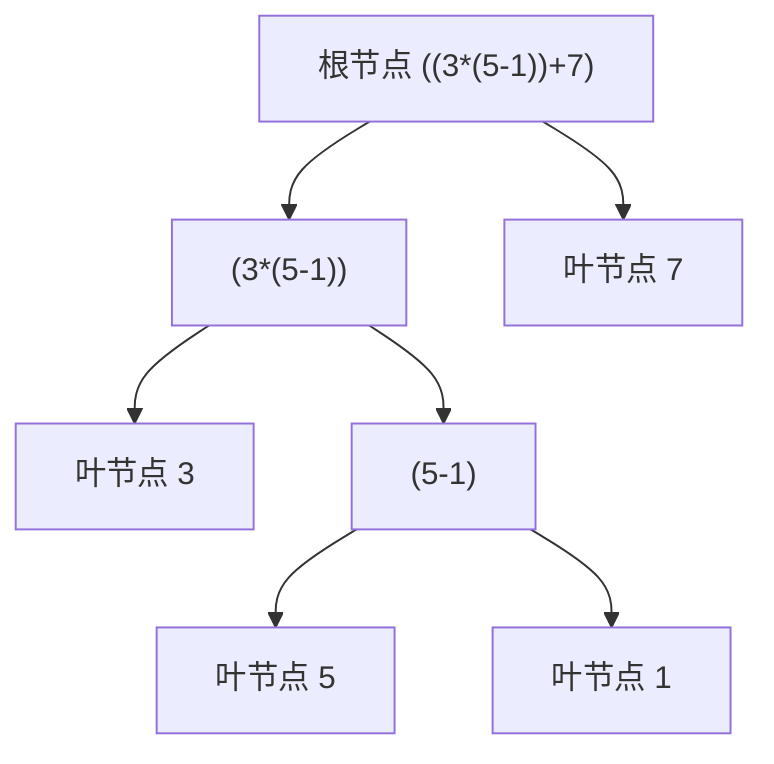
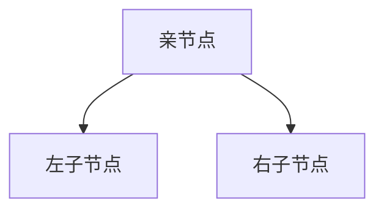
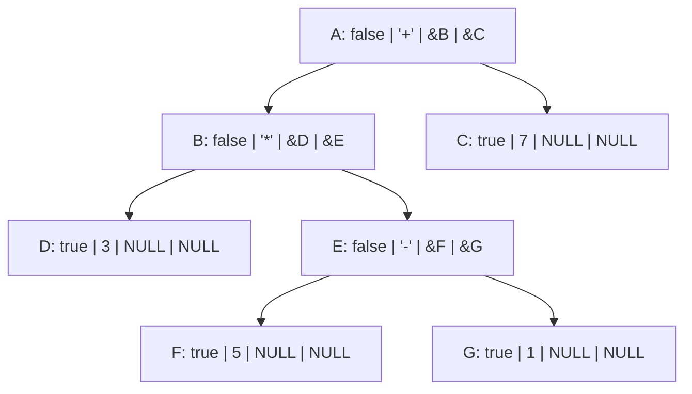
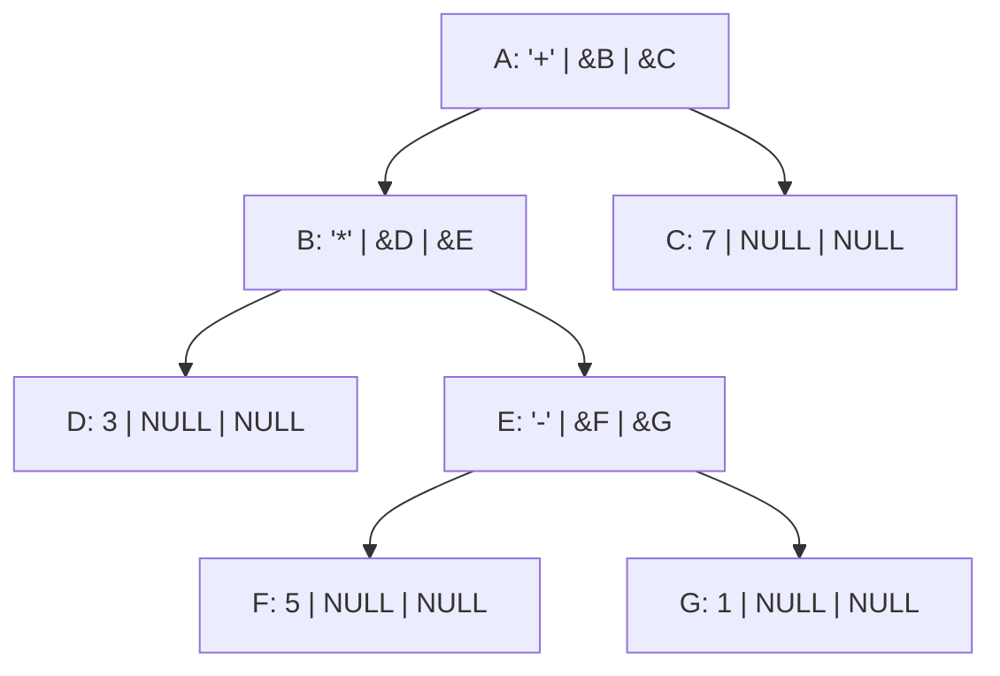

本节课将会讲三点内容，链表，栈以及二叉树。

<!--more-->

<!-- toc -->

## 链表

先来看一个简单的题目：

### 约瑟夫问题

 n个人围成一圈，从第一个人开始报数，数到m的人出列，再由下一个人重新从1开始报数，数到m的人再出圈，……依次类推，直到所有的人都出圈，请输出依次出圈人的编号。

**输入**

一行有两个数字，n和m，如题意。

**输出**

一行，为所有出圈人的编号。

**样例**

| 输入 | 输出                 |
| :--- | :------------------- |
| 10 3 | 3 6 9 2 7 1 8 5 10 4 |

**数据范围**

1 <= m <= n <= 100

### 解题思路

约瑟夫问题是一个典型的模拟问题。

#### 第一种思路（数组标记）

我们可以创建一个数组，数组长度不小于总人数，每当一个人出列时，在数组内做一个标记。

```cpp
int a[105];

// ...

int num=n,last=1;
    while(num){
        int cnt=0;
        for(int i=last;cnt!=m;i++){
            if(i>n) i%=n;
            if(a[i]==-1) continue;
            ++cnt;
            if(cnt==m){
                a[i]=-1;
                num--;
                last=i+1;
                printf("%d ",i);
                break;
            }
        }
    }
```

#### 第二种思路（索引数组）

我们需要一种存储方式，能够在修改后快速找到下一个有效位置，而不是顺序检查。

不妨采用这样的方式：

```cpp
int prev[105], next[105];

// ...

for(int i=1; i<=n; ++i)
{
	prev[i] = ((i-1)-1+n)%n+1;
	next[i] = ((i-1)+1  )%n+1;
}

// ...

// 去掉 下标 i 的人
next[prev[i]] = next[i];
prev[next[i]] = prev[i];
```

#### 第三种思路（索引链表）

上面的 prev 和 next 是分离的，有时候进行一些处理时可能不够直观，因此我们采用数据结构——链表。

先定义一个整合了 prev 和 next 的结构体：

```cpp
struct Node
{
    int prev;
    int next;
};
```

如果是 C，为了便于编程，在下面再加一行

```c
typedef struct Node Node;
```

在使用的时候，采用这种方式

```cpp
Node a[105];

// ...

// 去掉 下标 i 的人
a[a[i].prev].next = a[i].next;
a[a[i].next].prev = a[i].prev;
```

这种方式的使用有一些限制，其中最显然的一点是，a，也即是存储这些 Node 的对象，必须是可以使用整数作为索引的。

对于数组（和上节课描述过的 `std::vector` 、 `template<typename T> std::map<int, T>` 以及`std::set<int>` ）来说，这一假设可以满足，但是对于更多的情况，这一假设可能会限制我们的使用。

其次，这种方式使用时，还暗示了，删除一个元素很容易，然而增加新元素却很难。

考虑到 c 和 cpp 中常见的获取新的存储空间的方式（c：`malloc` ，`realloc` 和 `calloc` ；cpp：`new` ），我们可以认为，指针是一种通用的存储方式，因此，如果能用指针表示 prev 和 next ，我们就可以避免被上面的限制所束缚。

#### 第四种思路（链表）

在这里，我们选择使用指针作为索引。

```cpp
struct Node
{
	int id;
	Node *prev;
	Node *next;
};
```

如果是 C 语言，请在最前面加上 `typedef struct Node Node;`

去掉某个人，则采用这样的方法：

```cpp
void remove(Node *p)
{
    if(p->prev && p->next)
    {
        p->prev->next = p->next;
        p->next->prev = p->prev;
        delete p;
        // if in c, use free
    }
}
```

最后一种方式的优点在于，我们不需要事先准备一个足够大的数组，而是可以根据输入数据动态创建一个足够长的链。

### 什么是链表

链表是一种物理存储单元上非连续、非顺序的存储结构，数据元素的逻辑顺序是通过链表中的指针链接次序实现的。
链表由一系列结点（链表中每一个元素称为结点）组成，结点可以在运行时动态生成。
每个结点包括两个部分：一个是存储数据元素的数据域，另一个是存储下一个结点地址的指针域。 

例如，一个长度为 3 的链表可以是这样的。



这个链表共有三个元素，A-C。其中 A 的数据域为 1，指针域为 &B（B的地址）。最后的 C 数据域为 12，指针域为空（NULL）。可以使用一个循环来遍历这个链表：

```cpp
struct Node
{
    int v;
    Node *next;
};

Node *head = GetHead();
```

```cpp
for(Node *p = head; p; p = p->next)
{
    printf("%d\n", p->v);
}
```

### 链表和数组对比

此处的数组指广义数组（含`std::array` 及`std::vector`）

| 对比项           | 链表 | 数组 |
| :--------------- | :--- | ---- |
| 查找第 n 个元素  | O(n) | O(1) |
| 删去第 n 个元素  | O(1) | O(n) |
| 插入元素到某位置 | O(1) | O(n) |
| 将某一段逆序     | O(n) | O(n) |

### 链表的分类

+ 单链表
  + 数据域：数据；
  + 指针域：next 指针，表示其下一个节点的地址
+ 循环链表
  + 单链表
  + 最后一个节点的 next 为首个节点的地址
+ 双向链表
  + 指针域：next 指针和 prev 指针，分别表示下一个节点和上一个节点的地址。

### 链表 in STL

STL 中也有链表类型的实现：std::list

其支持的方法如下：

| **list成员** | **说明**                                                 |
| ------------ | -------------------------------------------------------- |
| operator=    | 赋值重载运算符                                           |
| assign       | 分配值                                                   |
| front        | 返回第一个元素的引用                                     |
| back         | 返回最后一元素的引用                                     |
| begin        | 返回第一个元素的指针(iterator)                           |
| end          | 返回最后一个元素的下一位置的指针                         |
| rbegin       | 返回链表最后一元素的后向指针(reverse_iterator or const)  |
| rend         | 返回链表第一元素的下一位置的后向指针                     |
| push_back    | 增加一元素到链表尾                                       |
| push_front   | 增加一元素到链表头                                       |
| pop_back     | pop_back()删除链表尾的一个元素                           |
| pop_front    | 删除链表头的一元素                                       |
| clear        | 删除所有元素                                             |
| erase        | 删除一个元素或一个区域的元素(两个重载)                   |
| remove       | 删除链表中匹配值的元素(匹配元素全部删除)                 |
| remove_if    | 删除条件满足的元素(遍历一次链表)，参数为自定义的回调函数 |
| empty        | 判断是否链表为空                                         |
| max_size     | 返回链表最大可能长度                                     |
| size         | 返回链表中元素个数                                       |
| resize       | 重新定义链表长度(两重载函数)                             |
| reverse      | 反转链表                                                 |
| sort         | 对链表排序，默认升序                                     |
| merge        | 合并两个有序链表并使之有序                               |
| splice       | 对两个链表进行结合(三个重载函数) 结合后第二个链表清空    |
| insert       | 在指定位置插入一个或多个元素(三个重载函数)               |
| swap         | 交换两个链表(两个重载)                                   |
| unique       | 删除相邻重复元素                                         |

## 栈

### 后缀表达式

所谓后缀表达式是指这样的一个表达式：式中不再引用括号，运算符号放在两个运算对象之后，所有计算按运算符号出现的顺序，严格地由左而右新进行（不用考虑运算符的优先级）。

如：`3*(5–1)+7`对应的后缀表达式为：`3 5 1 - * 7 +`。

**输入**

一行，其中运算符和运算数之间都用空格分隔，运算数是一个一位非负整数。

**输出**

 一行，表达式的值。

**样例**

| 输入          | 输出 |
| :------------ | :--- |
| 3 5 1 - * 7 + | 19   |

**数据范围**

无。

### 解题思路

这个问题看似麻烦，我们不妨先来手动模拟一次。

3 5 1 - * 7 +

首先参与运算的是 "5 1 -" ，得到结果 4，将 4 填在原来 "5 1 -" 的位置。

这时候，表达式为 3 4 * 7 +

我们接下来算乘法，得到结果 12

现在表达式为 12 7 +

两者相加，得到结果 19。

---

通过观察我们的求解过程，我们可以发现，我们每次选择最靠前的一个符号，并将其前方的两个数字进行运算。

但是具体实现起来该如何做呢？

<font size=5><del>>>>>**栈**<<<<</del></font>

结合前面的知识，我们发现，可以使用一个链表，这个链表结构如下：

```cpp
struct Node
{
	int type;
    int v;
    Node *next, *prev;
};
```

其中，type 表示其为数字还是为运算符。

如果是数字，v 表示 数字的值；如果为运算符，我们不妨用 0123 代指四种运算符。

接下来，每次从首个节点开始查找，找到第一个 `type == 运算符` 的节点，然后获得其前方的两个节点的值，运算后用其结果代替这三个节点。

等到最后，首元素的 next 为 NULL 的时候，即链表长度为 1 时，最后这个节点的 v 就是结果。

<del> 所以跟栈有什么关系 </del>

### 使用栈来解题

观察我们的解题思路，我们可以发现这样一个特点。

我们每次处理的时候，都只对前面的一部分数据进行处理。

如下：

1. <font color=gree>3 </font><font color=blue>5 1 </font><font color=red>-</font> <font color=gray>\* 7 +</font>

2. <font color=blue>3 4 </font><font color=red>\*</font> <font color=gray>7 +</font>

3. <font color=blue>12 7 </font><font color=red>+</font>

4. <font color=blue>19</font>

其中，我们可以发现，绿色和灰色的部分是完全不用考虑的。

每次操作是找到红色的操作符，然后取出蓝色的数字，进行运算后放回对应位置。

如果我们不看灰色部分，我们可以得到这样的操作流程：

每次取出最后一个节点（操作符），然后再取出两个节点作为操作数，运算后将结果放回原位置。

我们归纳这个过程，可以抽象出这样的行为：

1. 取出元素：从一系列元素的最后面获得一个元素，元素数量减一；

2. 放入元素：在一系列元素的最后面添加一个元素，元素数量加一。

在栈中，我们将这两个操作称为 push 和 pop。push 是压入一个元素，而 pop 是弹出一个元素。

---

通过整理上面的过程，我们可以得到这样的流程：
首先创建一个栈，然后读入数据，每当读入一个元素，就将一个元素压栈。（这里的元素包括数字和操作符）

如果刚刚压栈的是操作符，就弹出三个元素，按照出栈的顺序记为 a，b，c（其中，a 是刚刚压栈的操作符），并将 c (a) b 的结果压栈。

直到读入完数据后，栈中剩余一个元素，这个元素就是结果。

---

**更加简洁**

上面的方法中，每次操作符被压栈后就立即出栈，而这一过程可以被简化：

输入数据：

如果数据为 数字 ，则压栈；

如果数据为 操作符，则弹出两个数字，并将运算结果压栈。

### 栈的定义

栈（stack）又名堆栈，它是一种运算受限的线性表。
限定仅在表尾进行插入和删除操作的线性表。这一端被称为栈顶，相对地，把另一端称为栈底。
向一个栈插入新元素又称作进栈、入栈或压栈，它是把新元素放到栈顶元素的上面，使之成为新的栈顶元素；
从一个栈删除元素又称作出栈或退栈，它是把栈顶元素删除掉，使其相邻的元素成为新的栈顶元素。


**栈的特点可以概括为 FILO (First In Last Out)，即越先进去的元素，越后出来**

### 栈的常见实现

1. 可以用数组和一个数字模拟栈
2. STL std::stack
3. 用链表来实现栈。

### 提及队列

队列与栈相似，不同点在于其为先进先出。

### 线性数据结构对比

|                          | 数组（广义） | 链表 | 栈     | 队列       |
| :----------------------- | :----------- | ---- | ------ | ---------- |
| 支持下标操作（随机寻址） | 是           | 否   | 否     | 否         |
| 增删元素的复杂度         | O(n)         | O(1) | /      | /          |
| 支持遍历所有元素         | 是           | 是   | 否     | 否         |
| 求指定位置元素的复杂度   | O(1)         | O(n) | /      | /          |
| 在末端增加新元素复杂度   | O(1)         | O(1) | O(1)   | O(1)       |
| 能访问的元素数量         | 所有         | 所有 | 仅栈顶 | 仅队首     |
| 能操作的位点数量         | 所有         | 所有 | 仅栈顶 | 队首和队尾 |



## 二叉树


### 后缀表达式转中缀表达式

后缀表达式定义如前，请根据给定后缀表达式，采用完全加括号的形式，输出其确定的中缀表达式。

如：`3*(5–1)+7`对应的后缀表达式为：`3 5 1 - * 7 +`，我们对其完全加括号，可以得到`((3*(5-1))+7)` 。

**输入**

一行，其中运算符和运算数之间都用空格分隔，运算数是一个一位非负整数。

**输出**

 一行，中缀表达式。

**样例**

| 输入          | 输出          |
| :------------ | :------------ |
| 3 5 1 - * 7 + | ((3*(5-1))+7) |

**数据范围**

无。

### 解题思路

针对样例，我们可以发现，有这样的层级结构



每个表达式可以被抽象为 `(a op b)` 的形式，其中，a、b 为表达式，op 为操作符。

表达式有两种形式：`(a op b)` 或者 `a` ，其中 a、b 为表达式，op 为操作符。

也就是说，表达式可以是单个数字。

通过看图，我们可以发现，3、5、1、7 这四个节点，也就是操作数节点，没有下属节点（后称“子节点”）。
而当其有子节点的时候，如 `(5-1)` ，有两个操作数节点，因此有一层括号。

我们将其所有子节点的层数，取其中的最大值，称之为该节点的深度。
例如，`(5-1)` 深度为 1，`3` 深度为 0，而最终结果的深度为 `max(3, 1) = 3`。
对于深度为 d 的节点，其有 d 层括号。

因为这个层级结构像一棵倒置的树，因此这一结构被称为“树”。最上面的节点被称为根节点，而没有子节点的节点被称为叶节点。



也就是说，其结构如上所示。

对于每一组这样结构的节点



其中 A 被称为亲节点（或父节点），而 B、C 则称之为子节点。

亲节点和子节点的定义的相对的，没有绝对的亲节点，也没有绝对的子节点。
特别的，仅当节点数量为 1 时，树中不存在亲节点与子节点的关系。

像表达式树这种，每个节点（最多）有两个子节点的情况，我们分别将这两个子节点称为左子节点和右子节点。而这个树称之为二叉树。

### 二叉树定义

在计算机科学中，二叉树是每个结点最多有两个子树的树结构。通常子树被称作“左子树”（left subtree）和“右子树”（right subtree）。二叉树常被用于实现二叉查找树和二叉堆。

一棵深度为k，且有2^k-1个结点的二叉树，称为满二叉树。这种树的特点是每一层上的结点数都是最大结点数。而在一棵二叉树中，除最后一层外，若其余层都是满的，并且或者最后一层是满的，或者是在右边缺少连续若干结点，则此二叉树为完全二叉树。具有n个结点的完全二叉树的深度为floor(log2n)+1。深度为k的完全二叉树，至少有2k-1个叶子结点，至多有2k-1个结点。

### 怎么解题？

对于上面的题目，我们可以这样做：

将栈（后缀表达式）部分的计算过程进行修改。

**原来的过程是：**

输入一个元素；

如果是数字则压栈；

如果是操作符则出栈两个数字，运算后压栈。

**在这里，我们修改过程：**

输入一个元素；

如果是数字，则压栈一个值为此数字的节点；

如果是操作符，则出栈两个节点，生成新的节点后压栈。

**表达式的保存**

我们可以采用这样的结构：

```cpp
struct Node
{
    bool isNum;
    int val;
    Node *left, *right;
};
```

这样一来，上面的树就可以如下表示：



通过观察我们可以发现，所有叶节点都是操作数，非叶节点都是操作符。

因此我们可以使用这样的结构：

```cpp
struct Node
{
    int val;
    Node *left, *right;
};
```



而要判断一个节点是操作数还是操作符，可以如下判断：

```cpp
bool isNum(Node *p)
{
    return p->left == NULL && p->right == NULL;
}
```

在生成这样一个树形结构后，我们就可以进行输出。

### 二叉树遍历

> 遍历是对树的一种最基本的运算，所谓遍历二叉树，就是按一定的规则和顺序走遍二叉树的所有结点，使每一个结点都被访问一次，而且只被访问一次。由于二叉树是非线性结构，因此，树的遍历实质上是将二叉树的各个结点转换成为一个线性序列来表示。
>
> 设L、D、R分别表示遍历左子树、访问根结点和遍历右子树， 则对一棵二叉树的遍历有三种情况：DLR（称为先根次序遍历，也叫先序遍历），LDR（称为中根次序遍历，也叫中序遍历），LRD （称为后根次序遍历，也叫后序遍历）。

要输出表达式，我们采用中序遍历的方式。

对于每个节点，如果其为表达式，则遍历输出，如果为数字，则直接输出。